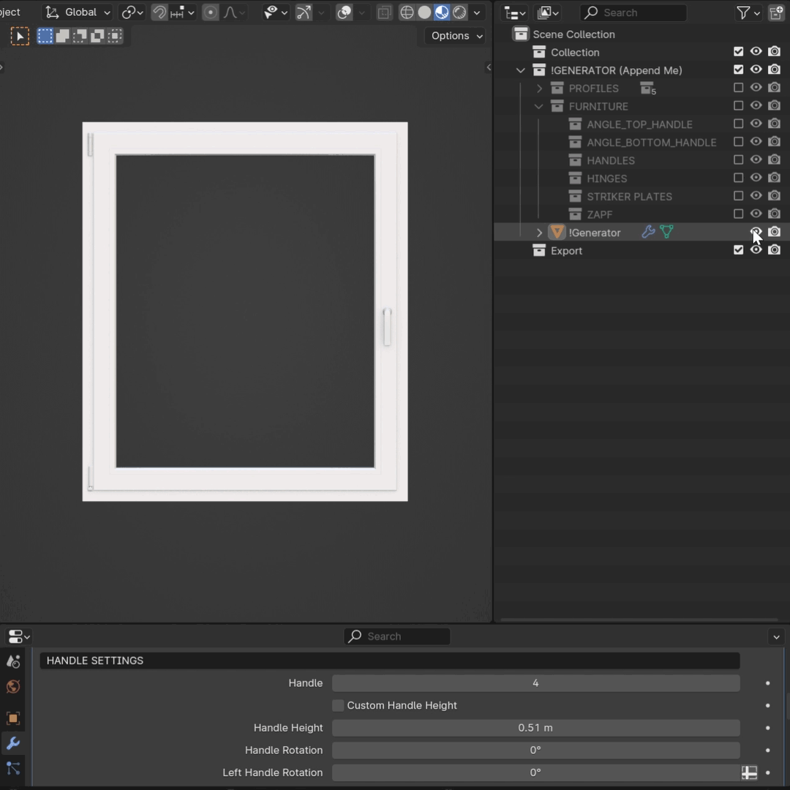
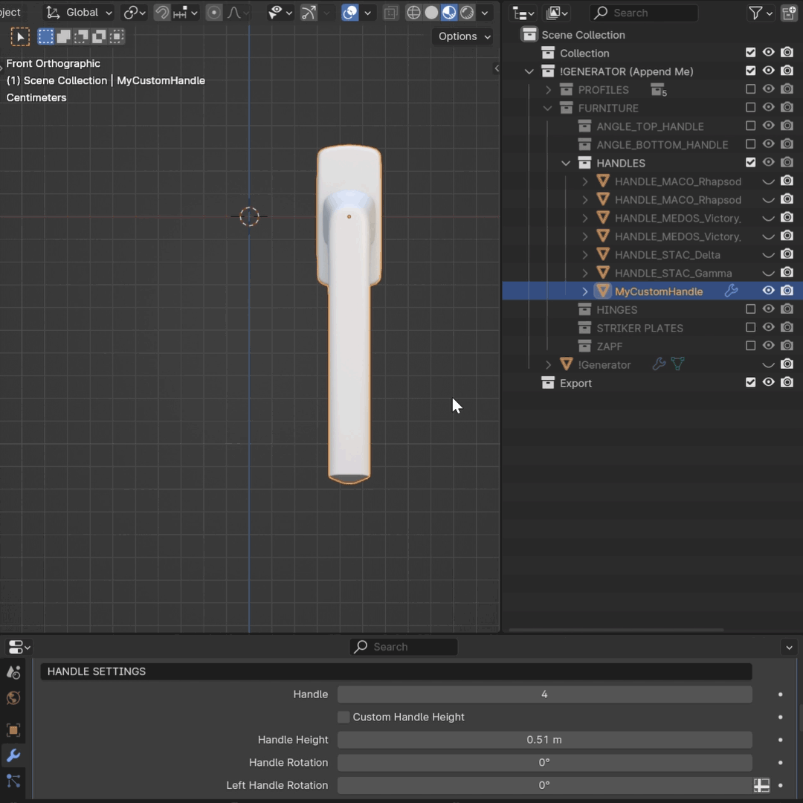
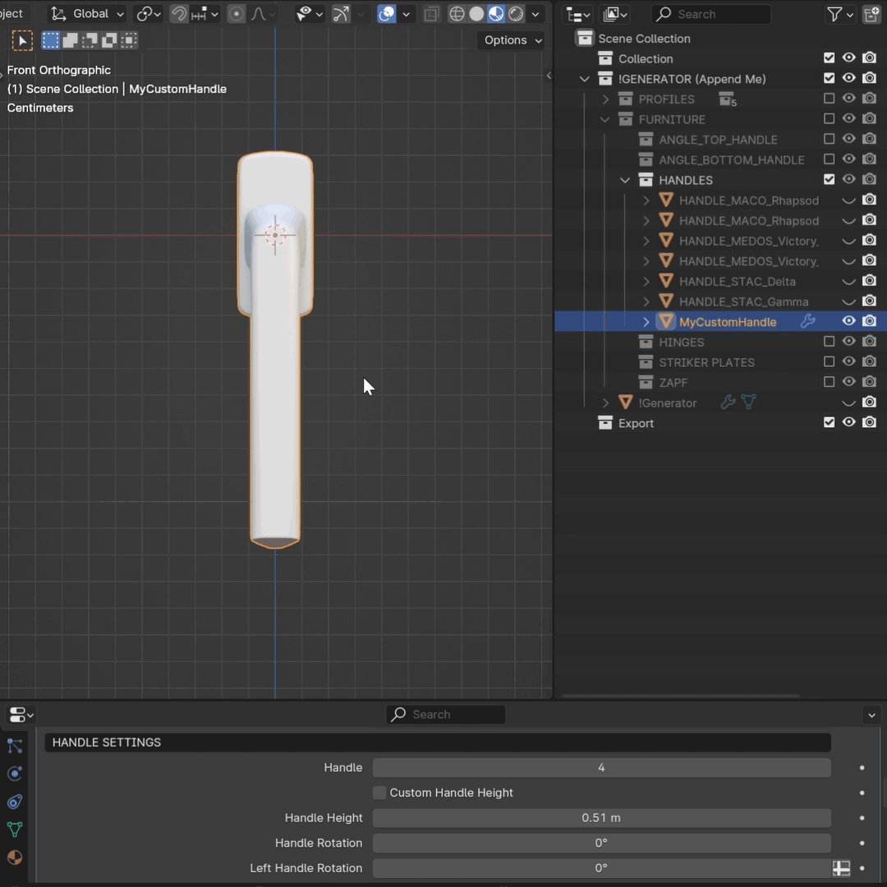
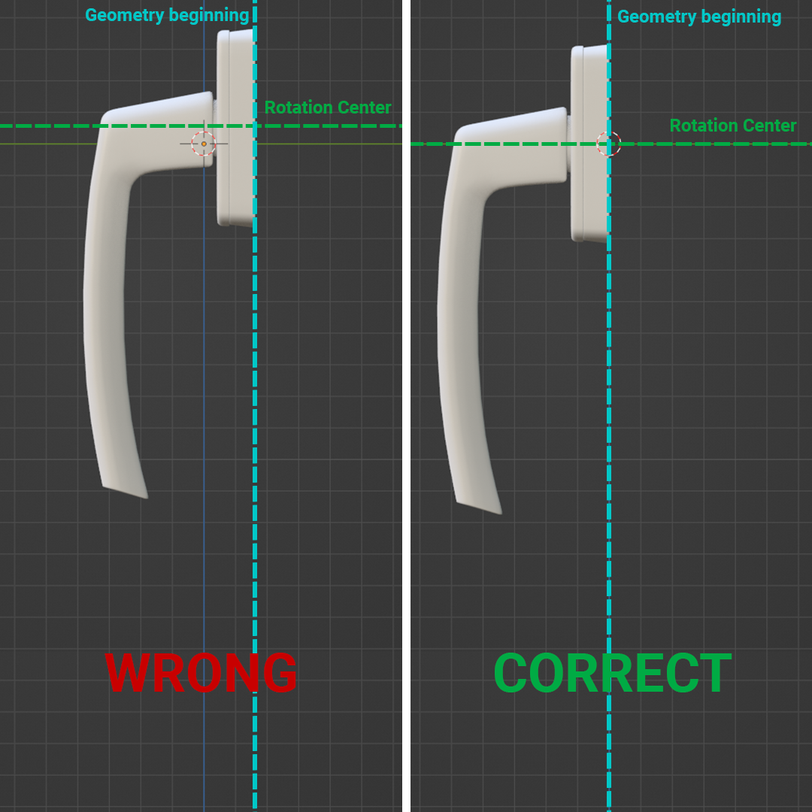
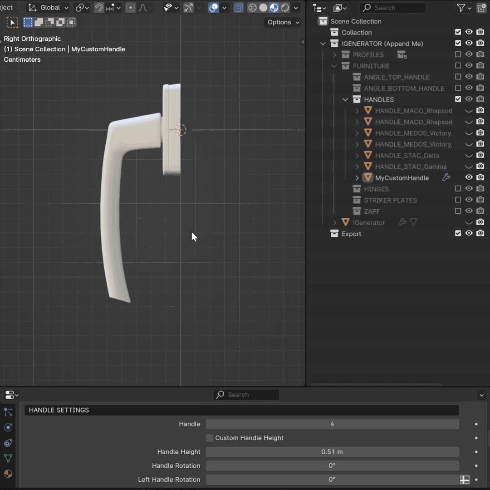
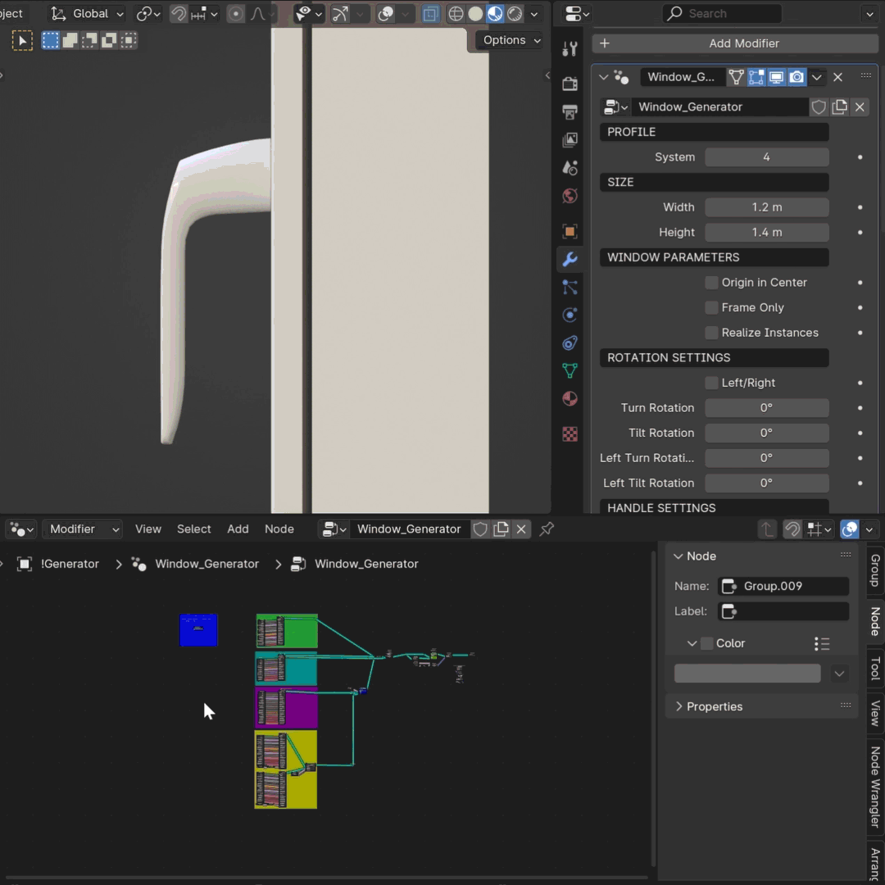
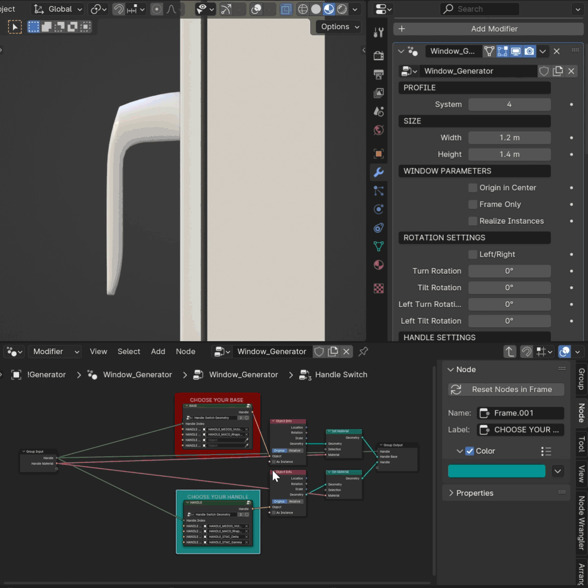

Customization
=============

How to add a custom handle
--------------------------

To add a custom handle, follow these steps:
1. Temporarily disable Generator in the viewport. Activate "HANDLES" collection inside "FURNITURE" collection.

2. Import your custom handle to the "HANDLES" collection.
.. note::
    Note that your custom handle must be comparable in size to the other handles in the collection.
        .. image:: images/04_customization_import.gif
            :alt: Import your Handle
            :width: 320
            :height: 320
            :align: left

3. Position your handle to the World Origin.

4. Navigate to the Right orthographic view (press 3 on your Numpad or press ~ on your keyboard and choose Right).

.. warning::
    Ensure your handle is oriented the same way as in the example provided. Press Ctrl+A to apply Scale and Rotation.

5. The origin of your handle must be at the beginning of the base geometry. The rotation center of the handle should be appropriately set to prevent clipping issues and ensure correct rotation.

6. If your handle and its base are joined into a single geometry, separate them to allow independent rotation of the handle while ensuring the base remains attached to the sash.

7. Unhide the Generator and select it.
8. Navigate to the geometry nodes tab.
9. Select Handle Switch node (located on the blue underlay) and press Tab to add your handle.

10. Change one of the current handles and its base to your custom handle.

