.. _parameters:

Parameters
==========

To simplify working with multiple windows in the scene, the settings panel will automatically display the name of the active window.

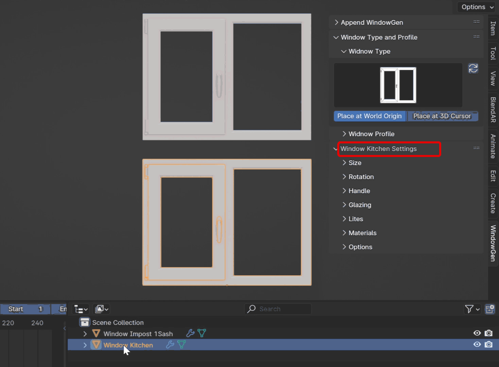

Common Parameters
-----------------

The parameters depend on the selected window preset. However, there are common parameters, including Profile, Width, Height, Handle Settings, Glazing Settings, Lites Settings, Materials Settings, and Options.

Window Profile
~~~~~~~~~~~~~~

This section features an icon gallery that allows you to choose one of the built-in window profiles. Click on the Profile icon:

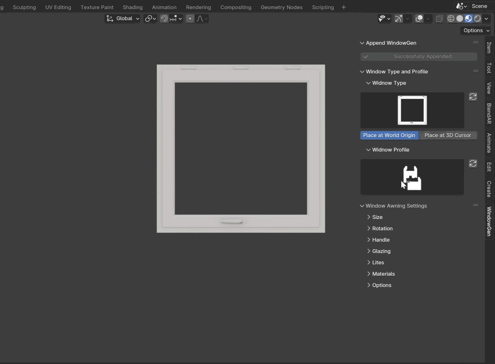

.. note::
    Custom profiles aren't currently supported due to dependencies on specific parameters for hinges, handles, and striker plates. Feel free to contact us for specific profile requests.

.. tip::
    If for some reason there are no previews, press the refresh button.

Size
~~~~

This section includes parameters for adjusting the width and height of the window.

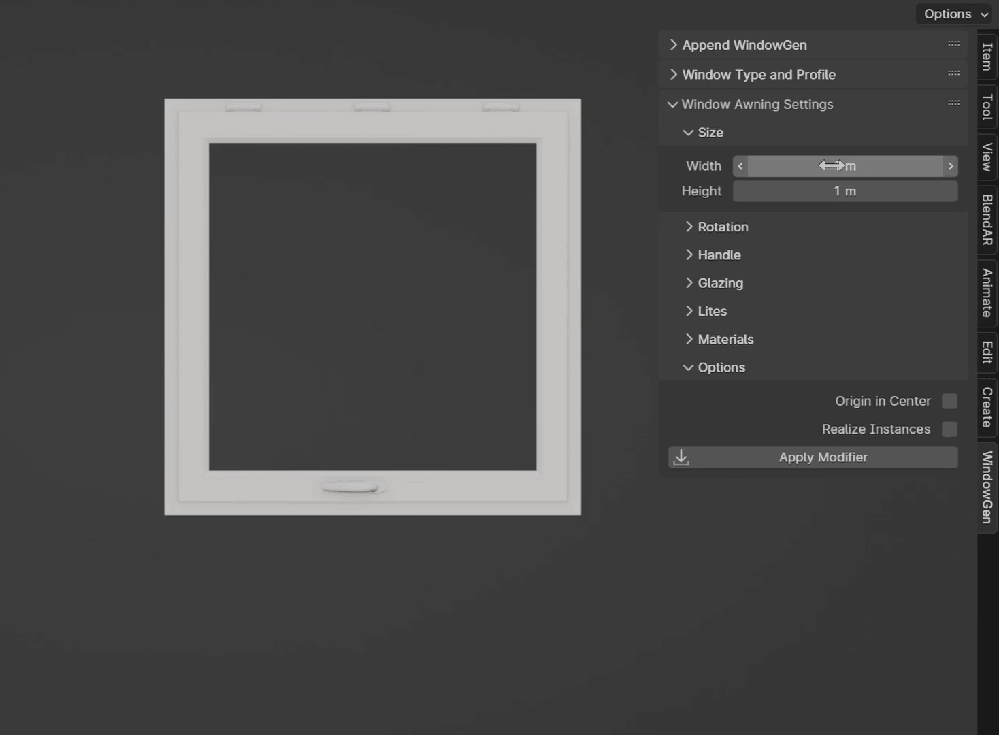

Rotation Settings
~~~~~~~~~~~~~~~~~
This section includes parameters for opening and sash rotation.

Opening
   Choose between inward or outward opening.
   .. image:: images/03_parameters_opening.gif
        :width: 75%

Handle Settings
~~~~~~~~~~~~~~~

This section includes parameters for handle type, position, and rotation.

Handle
    Choose from various handle types.
    
    .. image:: images/03_parameters_handle.gif
        :width: 75%

Custom Handle
    Choose your own handle. Refer to the :ref:`customization` on how to prepare it correctly.

    .. image:: images/03_parameters_01_handle_cutom.gif
        :width: 75%

Lever Geometry
    The part that you hold and turn to open or close the window.

    .. image:: images/03_parameters_01_handle_lever.png
        :width: 50%

Lever Backplate
    Fixed decorative plate around a window handle's base.

    .. image:: images/03_parameters_01_handle_backplate.png
        :width: 50%

Manual Handle Position
    Allows setting the position of the handle manually.

Handle Position
    Active when the **Manual Handle Position** is **turned on**. Adjust the handle's position.
    
    .. image:: images/03_parameters_handle_position.gif
        :width: 75%

Handle Rotation
    Sets the rotation of the handle.

    .. image:: images/03_parameters_handle_rotation.gif
        :width: 75%

Glazing Settings
~~~~~~~~~~~~~~~~

This section allows you to choose between double or triple glazing.

Glazing
    Choose between double glazing and triple glazing.
    
    .. image:: images/03_parameters_glazing.gif
        :width: 75%

Lites Settings
~~~~~~~~~~~~~~

Horizontal Lites
    Sets the number of horizontal lites.

    .. image:: images/03_parameters_01_lites_h.gif
        :width: 75%

Vertical Lites
    Sets the number of vertical lites.

    .. image:: images/03_parameters_01_lites_v.gif
        :width: 75%

Lites Width
    Sets the width of the lites.

    .. image:: images/03_parameters_01_lites_w.gif
        :width: 75%

Materials
~~~~~~~~~

This section allows you to assign materials to your window.

.. warning::
    For the materials to work correctly for mapping, choose the **UV Map** node and select UVMap (in some cases, the **Realize Instances** option must be enabled in the Options sections).
    
    .. image:: images/03_parameters_materials.png
        :width: 75%
        :align: center
        
.. note::
    - **UVMaps:** The window includes necessary UVMaps, although there may be rotation issues at certain widths due to limitations in controlling UV unwrapping in geometry nodes.
    - **Spacer Material:** If you wish to change the spacer material, it's recommended to adjust the existing material to your needs as it contains a custom bump map for a realistic look and helps to reduce extra geometry for the spacer.
    
Options
~~~~~~~

This section includes parameters for centering the window, realizing instances, and applying the modifier.

Origin in Center
    Centers the window within the geometry bounding box.

    .. image:: images/03_parameters_origin.gif
        :width: 75%

Realize Instances
    Converts instances into real geometry.
 
    .. image:: images/03_parameters_instances.gif
        :width: 75%

Apply Modifier
    Applies the geometry nodes modifier.
 
    .. image:: images/03_parameters_apply.gif
        :width: 75%

    .. important::
        For this option to work correctly please activate built-in "Modifier Tools" add-on in Prefernces.

    .. warning::
        Once applied, you will lose the ability to adjust any of the modifier's parameters. Press this button if you are ready to export the window to another program or if you need to edit the final window directly (e.g., deleting or adding elements).

Window Awning
-------------
 A top-hinged window that swings outward from the bottom.

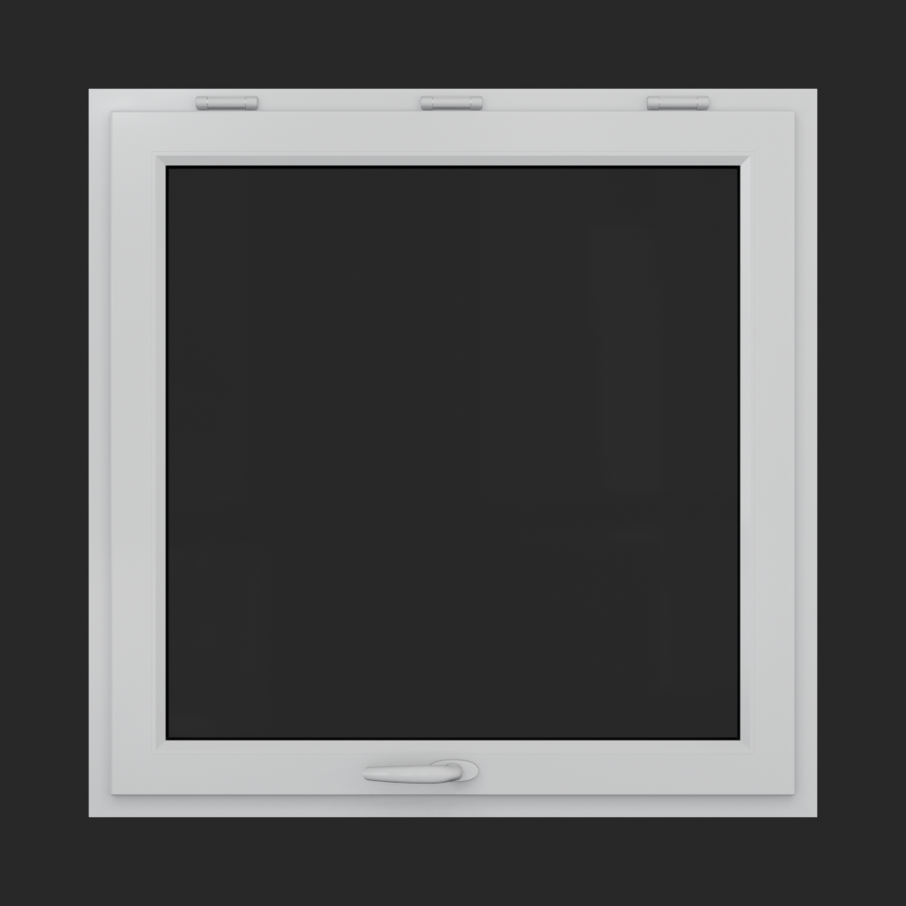

Rotation Settings
~~~~~~~~~~~~~~~~~

This section includes parameters for adjusting the tilt rotation of the sash.

Tilt Angle
    Sets the tilt angle of the sash.

    .. image:: images/03_parameters_01_sash_tilt.gif
        :width: 75%

Window Hopper
-------------
 A bottom-hinged window that tilts inward from the top.

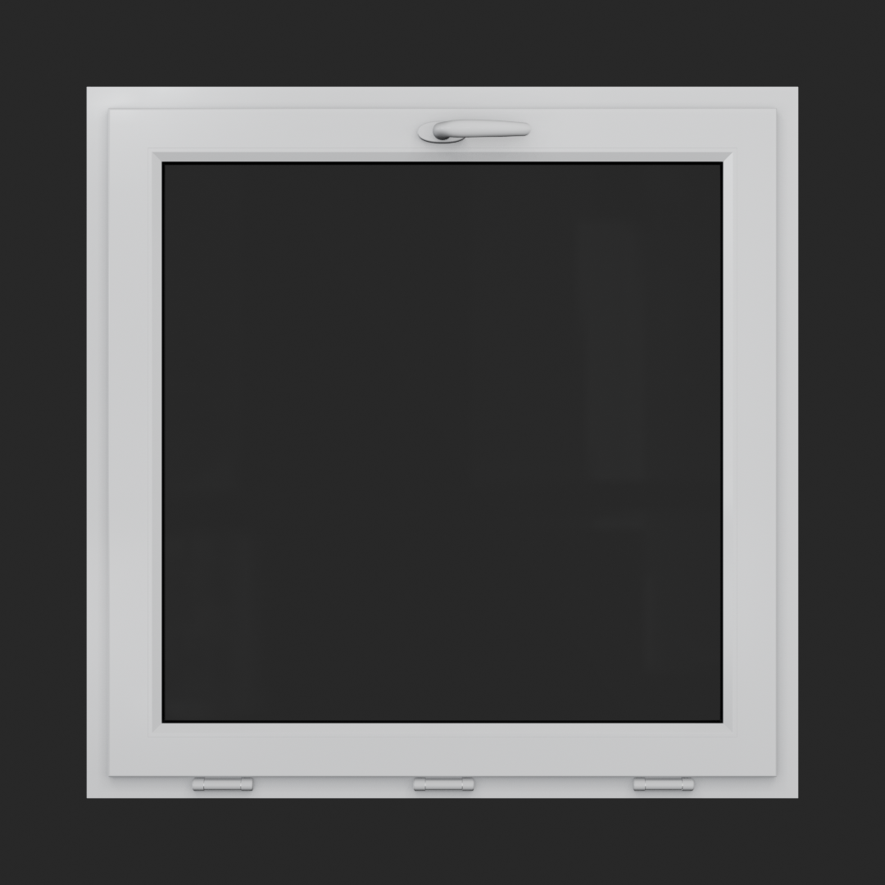

Rotation Settings
~~~~~~~~~~~~~~~~~

This section includes parameters for adjusting the tilt rotation of the sash.

Tilt Angle
    Sets the tilt angle of the sash.

    .. image:: images/03_parameters_02_sash_tilt.gif
        :width: 75%

Window Mullion 1 Sash
---------------------
 A window featuring a single operable sash alongside a fixed, non-opening section.

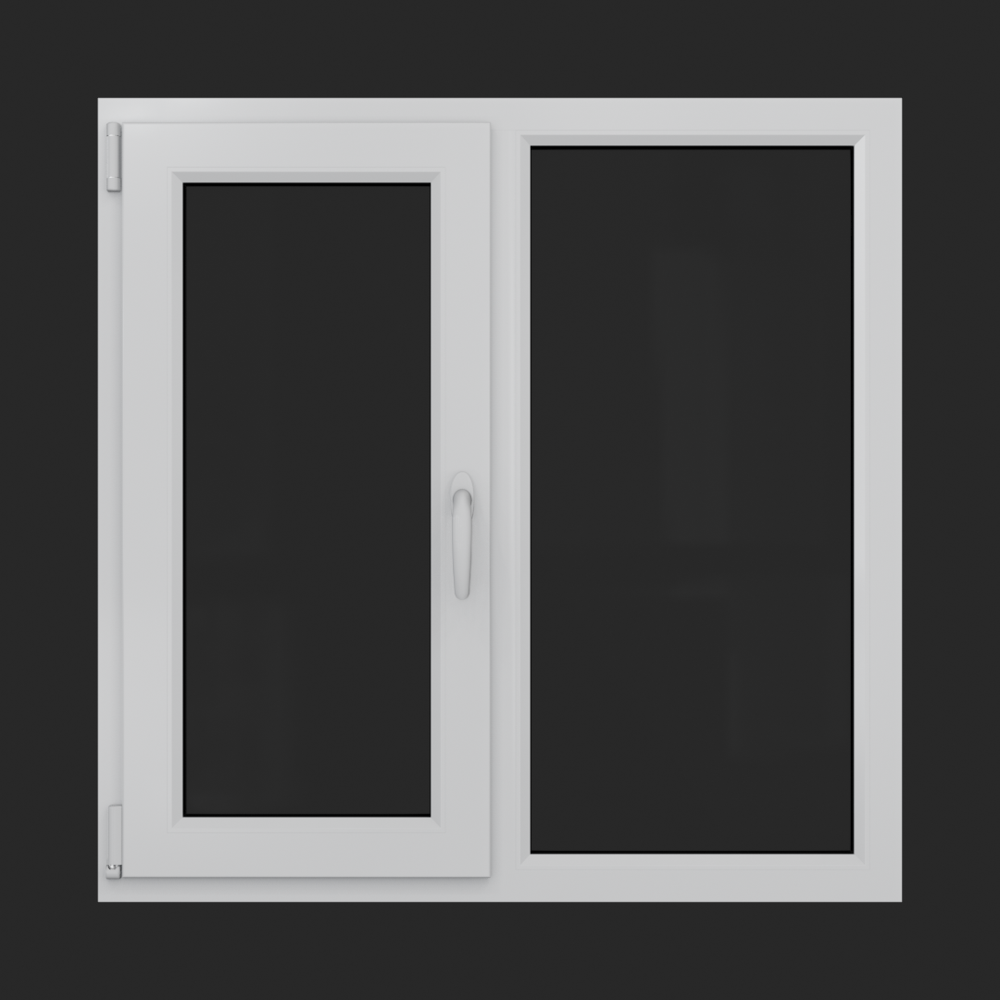

Size
~~~~

This section includes parameters for adjusting the width and height of the window.

Mullion Centered
    Automatically calculates even space for sashes and a fixed frame. Turned on by default.
    
    .. image:: images/03_parameters_03_mullion_centered.gif
        :width: 75%

Mullion Frame Width
    Sets the width of the fixed frame. Active when the **Mullion Centered** is **turned off**.
    
    .. image:: images/03_parameters_03_mullion_width.gif
        :width: 75%

Rotation Settings
~~~~~~~~~~~~~~~~~

This section includes parameters for adjusting the turn and tilt rotations of the sash.

Sash Position
    Switch between left and right sashes.
   
    .. image:: images/03_parameters_03_left_right.gif
        :width: 75%

Turn Angle
    Sets the turn angle of the sash.

    .. image:: images/03_parameters_03_sash_turn.gif
        :width: 75%

Tilt Angle
    Sets the tilt angle of the sash.

    .. image:: images/03_parameters_03_sash_tilt.gif
        :width: 75%

    .. important::
        Max tilt angle is constrained by the size of the scissors.

Window Mullion 2 Sash
---------------------
 A window with two operable sashes that can either tilt or turn.

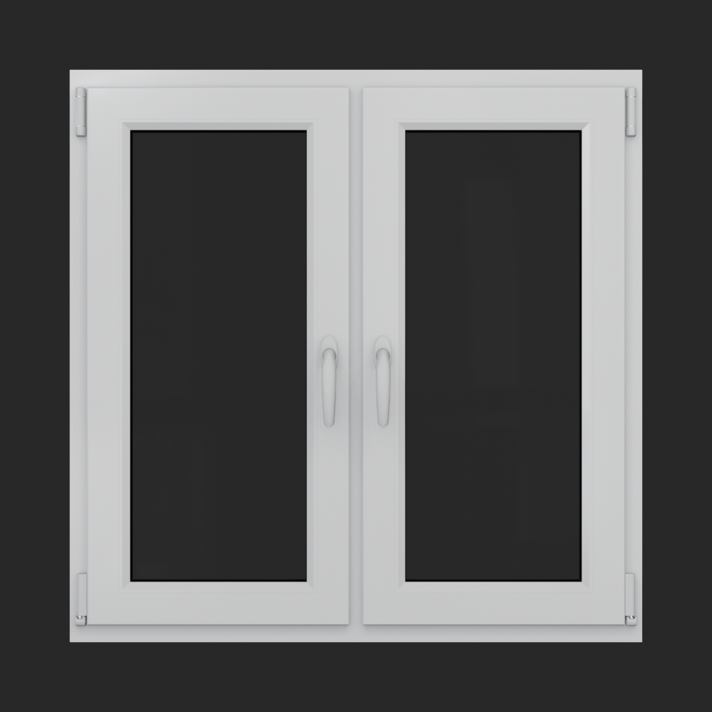

Rotation Settings
~~~~~~~~~~~~~~~~~

This section includes parameters for adjusting the turn and tilt rotations of the sashes.

Right Sash Turn
    Sets the turn angle of the right sash.

    .. image:: images/03_parameters_04_sash_turn_r.gif
        :width: 75%

Right Sash Tilt
    Sets the tilt angle of the right sash.

    .. image:: images/03_parameters_04_sash_tilt_r.gif
        :width: 75%

    .. important::
        Max tilt angle is constrained by the size of the scissors.

Left Sash Turn
    Sets the turn angle of the left sash.

    .. image:: images/03_parameters_04_sash_turn_l.gif
        :width: 75%

Left Sash Tilt
    Sets the tilt angle of the left sash.

    .. image:: images/03_parameters_04_sash_tilt_l.gif
        :width: 75%

    .. important::
        Max tilt angle is constrained by the size of the scissors.

Window Mullion 3 Sash
---------------------
 A window featuring two operable sashes with a fixed, non-opening section in the middle.

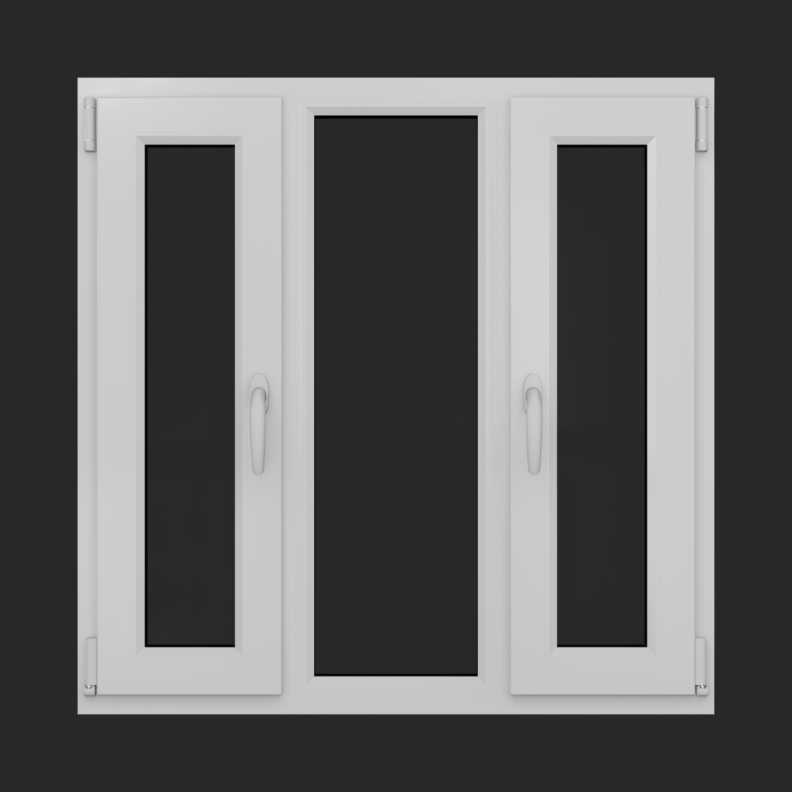

Size
~~~~

This section includes parameters for adjusting the width and height of the window.

Mullion Centered
    Automatically calculates even space for sashes and a fixed frame. Turned on by default.
    
    .. image:: images/03_parameters_05_mullion_centered.gif
        :width: 75%

Mullion Frame Width
    Sets the width of the fixed frame. Active when the **Mullion Centered** is **turned off**.
    
    .. image:: images/03_parameters_05_mullion_width.gif
        :width: 75%

Rotation Settings
~~~~~~~~~~~~~~~~~

This section includes parameters for adjusting the turn and tilt rotations of the sashes.

Right Sash Turn
    Sets the turn angle of the right sash.

    .. image:: images/03_parameters_05_sash_turn_r.gif
        :width: 75%

Right Sash Tilt
    Sets the tilt angle of the right sash.

    .. image:: images/03_parameters_05_sash_tilt_r.gif
        :width: 75%

    .. important::
        Max tilt angle is constrained by the size of the scissors.

Left Sash Turn
    Sets the turn angle of the left sash.

    .. image:: images/03_parameters_05_sash_turn_l.gif
        :width: 75%

Left Sash Tilt
    Sets the tilt angle of the left sash.

    .. image:: images/03_parameters_05_sash_tilt_l.gif
        :width: 75%

    .. important::
        Max tilt angle is constrained by the size of the scissors.

Window Single
-------------
 A window featuring a single operable sash that can either tilt or turn.

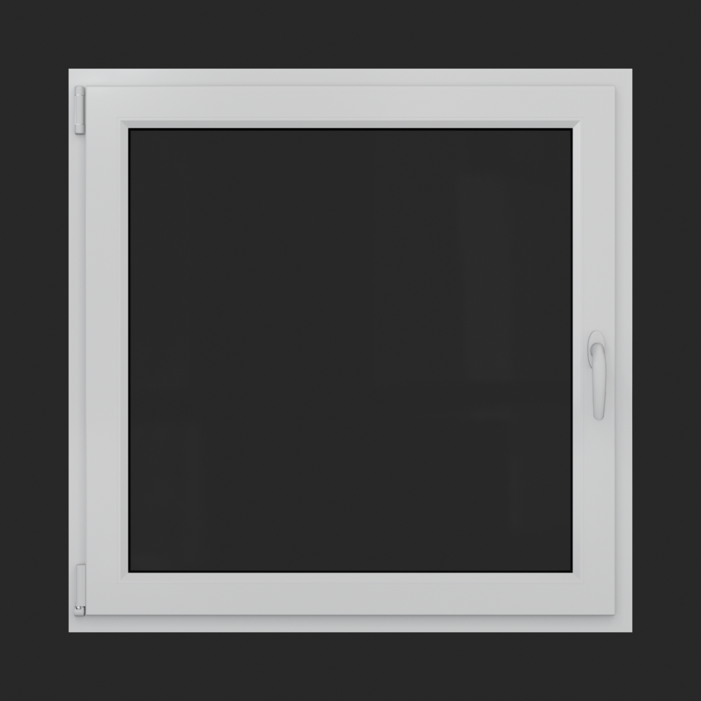

Rotation Settings
~~~~~~~~~~~~~~~~~

This section includes parameters for adjusting the turn and tilt rotations of the sash.

Opening
    Sets the direction in which sash will be opening.

    .. image:: images/03_parameters_06_sash_opening.gif
        :width: 75%

Turn Angle
    Sets the turn angle of the sash.

    .. image:: images/03_parameters_06_sash_turn.gif
        :width: 75%

Tilt Angle
    Sets the tilt angle of the sash.

    .. image:: images/03_parameters_06_sash_tilt.gif
        :width: 75%

    .. important::
        Max tilt angle is constrained by the size of the scissors.

Window Single Frame
-------------------
 A window with a fixed, non-opening section.

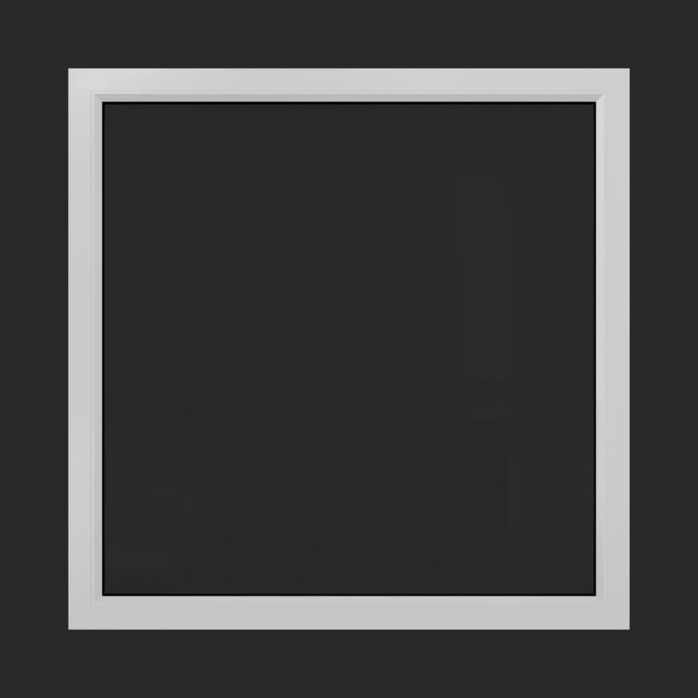

Window Stulp
---------------
 A window with two sashes featuring a large, unobstructed opening without a central mullion.

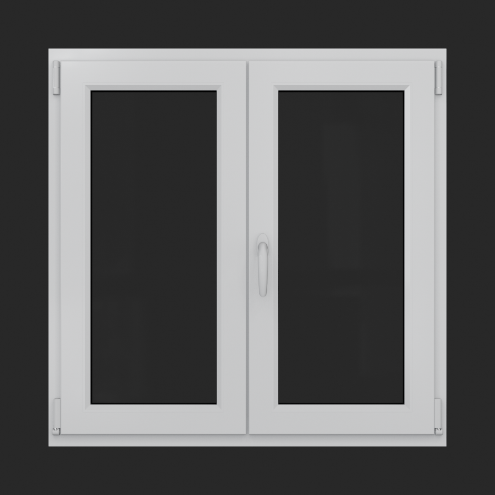

Rotation Settings
~~~~~~~~~~~~~~~~~

This section includes parameters for adjusting the turn and tilt rotations of the sashes.

Leading Sash
    Switch between left and right leading sashes.
   
    .. image:: images/03_parameters_08_left_right.gif
        :width: 75%

Right Sash Turn
    Sets the turn angle of the right sash.

    .. image:: images/03_parameters_08_sash_turn_r.gif
        :width: 75%

Right Sash Tilt
    Sets the tilt angle of the right sash.

    .. image:: images/03_parameters_08_sash_tilt_r.gif
        :width: 75%

    .. important::
        Max tilt angle is constrained by the size of the scissors.

Left Sash Turn
    Sets the turn angle of the left sash.

    .. image:: images/03_parameters_08_sash_turn_l.gif
        :width: 75%

Left Sash Tilt
    Sets the tilt angle of the left sash.

    .. image:: images/03_parameters_08_sash_tilt_l.gif
        :width: 75%

    .. important::
        Max tilt angle is constrained by the size of the scissors.
