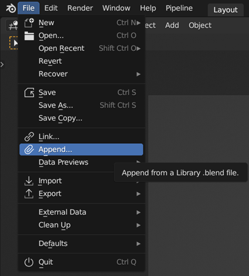
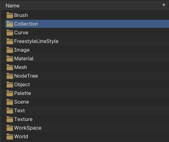
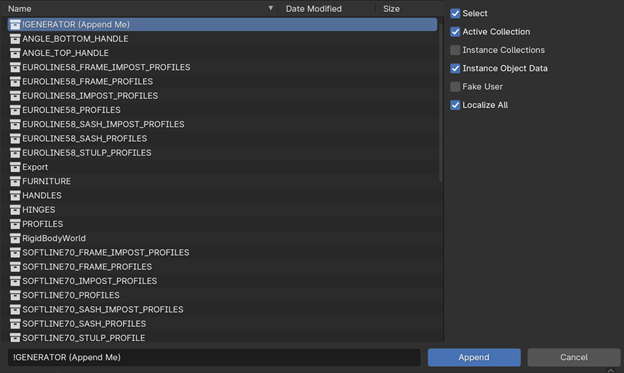
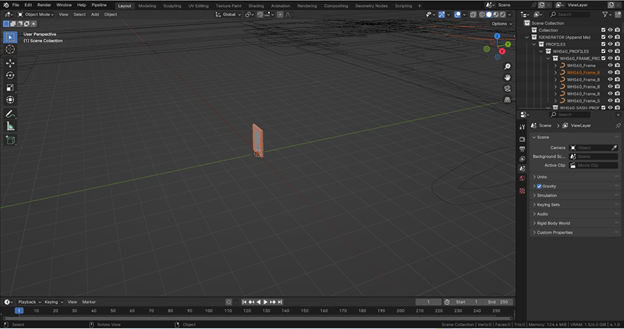

Starting Up
===========

How to add a generator to your scene
------------------------------------

To incorporate a generator into your Blender scene follow these steps:
1. Click on "File" in the top left corner.
2. Select "Append…".

3. Navigate to the folder where you saved the .blend file containing the generator and double-click on it.
4. Within the file, navigate to the Collection folder.

5. Select "!GENERATOR (Append Me)" and click "Append" in the bottom right corner.

Your scene should now reflect the changes made by appending the generator. You can easily disable the "PROFILES" and "FURNITURE" collections as they include the modeled geometry used in the generator such as PVC profiles and furniture.
