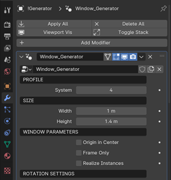

Working With The Generator
==========================

How to change parameters
------------------------

The generator utilizes the geometry nodes modifier. To adjust parameters, follow these steps:

1. Select the "!Generator" object.
2. Click on the wrench icon (Modifier Properties) on the right-hand side.

Generator structure
-------------------

The generator is divided into the following sections:
- Profile: Choose from 5 built-in profiles.
- Size: Adjust the size of your window.
- Window parameters: Customize window features such as centering sash disabling and instance realization.
- Rotation settings: Modify sash rotation.
- Handle settings: Choose handle type, position, and rotation.
- Glazing settings: Select between double or triple glazing.
- Impost settings: Control the presence and attributes of the impost.
- Stulp settings: Configure settings for two-sash windows without impost.
- Materials: Assign window materials.